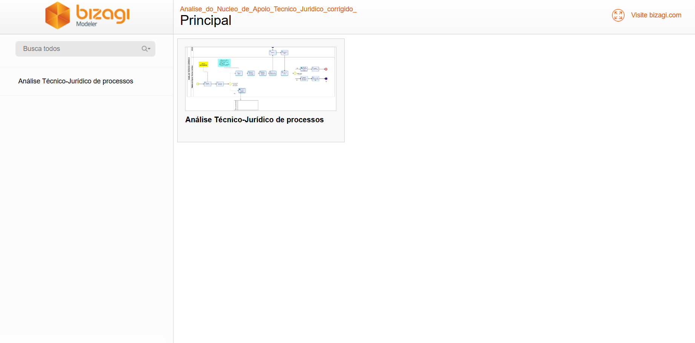

# Mapeamento de Processos da Justiça Federal do Rio Grande do Norte (JFRN)

## 📚 Sobre o Projeto

Este repositório contém um **site para o amarzenamento de mapeamentos de processos da Justiça Federal do Rio Grande do Norte (JFRN)**. O site é uma iniciativa destinada a apresentar os mapeamentos de processos relacionados às atividades judiciais e administrativas das diversas instâncias da Justiça Federal do RN. 

Os mapeamentos foram elaborados utilizando o **Bizagi Modeler**, uma ferramenta especializada em modelagem de processos que segue as melhores práticas de BPMN (Business Process Model and Notation). O objetivo é proporcionar clareza, organização e acessibilidade às informações processuais, contribuindo para maior eficiência e transparência nos serviços judiciais.

---

## 🌟 Funcionalidades

- Visualização de **processos mapeados** das instâncias da Justiça Federal do RN.
- Navegação intuitiva e responsiva para facilitar o acesso às informações.
- Design claro e funcional para uma experiência do usuário eficiente.
- Atualizações contínuas para garantir a precisão e relevância das informações exibidas.

---

## 🔧 Tecnologias Utilizadas

- **Bizagi Modeler**: Para a criação dos diagramas e mapeamentos processuais.
- **HTML, CSS e JavaScript**: Desenvolvimento da interface e funcionalidades do site.
- **Hospedagem Web**: Github.

---

## 📷 Prévia do Site

 
*Exemplo de visualização do site com o mapeamento de processos.*

---

## 📂 Estrutura do Repositório

```plaintext
├── /docs             # Documentação e arquivos explicativos
├── /images           # Imagens e assets para o site
├── /src              # Código-fonte do site
│   ├── /css          # Arquivos de estilo
│   ├── /js           # Scripts e funcionalidades
│   └── /html         # Páginas HTML
├── README.md         # Arquivo com informações do repositório
